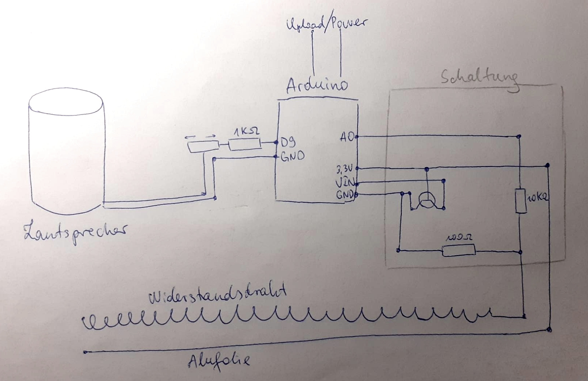

# arduino-trautonium

---
*ENGLISH*

Trautonium is the predecessor of today's sythesizers invented in 1930 by the
German engineer Friedrich Trautwein. It uses a resistor wire over a metal plate
to generate different resistances which are converted into different sounds with
a special circuit. You can find more information on
[Wikipedia](https://en.wikipedia.org/wiki/Trautonium) and
[doepfer.de](https://doepfer.de/traut/traut_e.htm).

This is the result of a school group work in which we built a trautonium
using an Arduino.

---
*DEUTSCH*

Das Trautonium ist der Vorläufer der heutigen Synthesizer, welches 1930 vom
deutschen Ingenieur Friedrich Trautwein erfunden wurde. Anstatt der Tasten wird
dabei ein Widerstandsdraht über einer Metallplatte verwendet, um
unterschiedliche Widerstände zu erzeugen, die mithilfe eines Schaltkreises in
unterschiedliche Töne umgewandelt werden. Für mehr Informationen siehe
[Wikipedia](https://de.wikipedia.org/wiki/Trautonium) und
[doepfer.de](https://doepfer.de/traut/traut_d.htm).

Das ist das Ergebnis einer Gruppenarbeit in der Schule, bei der wir
ein Trautonium mithilfe eines Arduinos gebaut haben.
